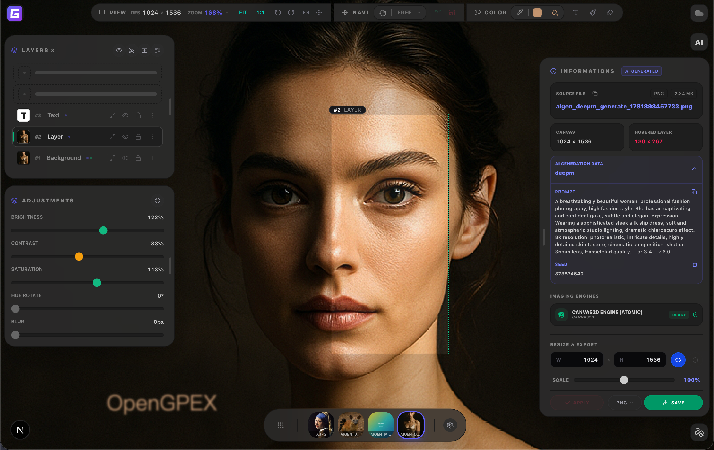

<p align="center">
  
</p>

<h1 align="center">OpenGPEX</h1>

<p align="center">
  <strong>Industrial-grade, browser-native Graphics & Photo Editor</strong><br/>
  Non-destructive editing · Tiled rendering · Plugin extensible · No install needed
</p>

<!-- ═══════════ Badges ═══════════ -->
<p align="center">
  
  <a href="./LICENSE"></a>
  
  
  
  
</p>

<!-- ═══════════ CTA ═══════════ -->
<p align="center">
  <a href="#-quick-start">Quick Start</a>&nbsp;&nbsp;|&nbsp;&nbsp;
  <a href="https://gpex.cloud/docs">Docs</a>&nbsp;&nbsp;|&nbsp;&nbsp;
  <a href="#-plugin-system">Plugins</a>&nbsp;&nbsp;|&nbsp;&nbsp;
  <a href="./CHANGELOG.md">Changelog</a>
</p>

---

<!-- ═══════════ Hero ═══════════ -->
<p align="center">
  <a href="https://gpex.cloud">
    
  </a>
</p>

<p align="center"><em>👆 Try it live at <a href="https://gpex.cloud">gpex.cloud</a> — Drag an image → edit with layers, masks & AI tools → export. All in the browser.</em></p>

> [!NOTE]
> **Beta** — Core editing is stable and developer-tested. Some advanced features are being polished. [Issues](https://github.com/gpex-cloud/opengpex/issues) and PRs are welcome!

---

## ✨ Why OpenGPEX?

| Feature | Description |
|---------|-------------|
| 🚀 **Tiled Rendering** | Chunked image processing with Mipmap pyramids + Web Worker synthesis. Handles 100MP+ images — no OOM. |
| ⚡ **60 FPS Interactions** | Dual-track state: pan/zoom/brush bypass React VDOM entirely via volatile refs. |
| 🕰️ **TimeTravel Undo** | Incremental undo via Immer JSON Patches — near-zero memory overhead per step. |
| 🛡️ **Non-Destructive CAS** | Original pixels immutably stored (SHA-256 Content-Addressable). Edits are pure math. |
| 🧩 **Plugin System** | Metadata-driven registry: overlays, drawers, options, backstage. Hot-load community ZIPs at runtime. |
| 🤖 **AI Built-in** | Background removal (RMBG 1.4 / InSPyReNet), magic wand — all client-side ONNX. |
| ☁️ **Cloud Sync** | Optional [GPEX Cloud](https://gpex.cloud) — save, load, share across devices. |
| 🖼️ **Format Support** | PSD · PNG · JPEG · WebP · AVIF · SVG · RAW (CR2/NEF/ARW) · HEIC |

---

## 🌐 Try It Now

> **No setup required** — Open **[gpex.cloud](https://gpex.cloud)** in your browser and start editing immediately.  
> Cloud version includes auto-save, cross-device sync, and always up-to-date features.

---

## 🚀 Quick Start

```bash
git clone https://github.com/gpex-cloud/opengpex.git && cd opengpex && pnpm install && pnpm dev
```

Open **http://localhost:3030** — drag an image in to start editing.  
Or skip setup entirely: **[gpex.cloud](https://gpex.cloud)** (online version).

<details>
<summary>Production build</summary>

```bash
pnpm build && pnpm start
```
</details>

---

## 🧩 Plugin System

Everything in OpenGPEX is a plugin — tools, panels, overlays, and effects.

```
plugins/
├── base/         # Official plugins (shipped with core)
├── community/    # Community-contributed
└── user/         # Your local dev sandbox
```

Install plugins at runtime via ZIP upload through the Plugin Hub. Build your own with the [Plugin Development Guide](https://gpex.cloud/docs/plugin-overview).

---

## 🛠️ Tech Stack

| Layer | Technology |
|-------|-----------|
| Framework | Next.js 16 · React 19 |
| State | Immer + custom store with fast-track volatile refs |
| Styling | Tailwind CSS v4 |
| Rendering | OffscreenCanvas + Web Workers + WASM (AVIF/RAW/TIFF) |
| AI/ML | ONNX Runtime (client-side inference) |
| Animation | Framer Motion · GSAP |

---

## 🤝 Contributing

Contributions are welcome! See [CONTRIBUTING.md](./CONTRIBUTING.md) for details.

```bash
# Fork → Clone → Branch → Code → Lint → PR
pnpm lint   # Run before committing
```

---

## 📄 Third-party Models

AI features download pre-trained models at runtime from HuggingFace (not bundled):

| Model | Source | License |
|-------|--------|---------|
| RMBG 1.4 | [briaai/RMBG-1.4](https://huggingface.co/briaai/RMBG-1.4) | BRIA RMBG-1.4 (non-commercial) |
| InSPyReNet Ultra | [OS-Software/InSPyReNet-SwinB-Plus-Ultra-ONNX](https://huggingface.co/OS-Software/InSPyReNet-SwinB-Plus-Ultra-ONNX) | MIT |

---

## 📦 Third-party Libraries

The following pre-compiled WASM/JS libraries are bundled in `public/ext/` for client-side format processing:

> [!NOTE]
> Next.js is configured with Cross-Origin Isolation headers (`COOP`/`COEP`) to enable `SharedArrayBuffer`, allowing multi-threaded WASM processing (e.g. for `wasm-vips`).

| Library | Purpose | Source | License |
|---------|---------|--------|---------|
| LibRaw-Wasm | RAW image decoding (CR2/NEF/ARW) | [ybouane/LibRaw-Wasm](https://github.com/ybouane/LibRaw-Wasm) | ISC |
| resvg-js | SVG rendering & rasterization | [thx/resvg-js](https://github.com/thx/resvg-js) | MPL-2.0 |
| jSquash (AVIF) | AVIF image encoding | [jamsinclair/jSquash](https://github.com/jamsinclair/jSquash) | Apache-2.0 |
| ghostpdl-wasm | PostScript/PDF processing | [okathira-dev/ghostpdl-wasm](https://github.com/okathira-dev/ghostpdl-wasm) | AGPL-3.0 |
| heic-to | HEIC/HEIF format conversion | [hoppergee/heic-to](https://github.com/hoppergee/heic-to) | GPL-3.0 |
| wasm-vips | TIFF image encoding & decoding | [kleisauke/wasm-vips](https://github.com/kleisauke/wasm-vips) | MIT / LGPL-3.0 |

---

## ⚖️ License

**GPL-3.0-only** — see [LICENSE](./LICENSE).

Third-party plugins loaded dynamically at runtime are independent works and may use any license. Plugins in the source tree are covered by GPL-3.0.

---

<p align="center">
  <sub>If OpenGPEX helps you, consider giving it a ⭐ — it keeps the project going!</sub>
</p>
