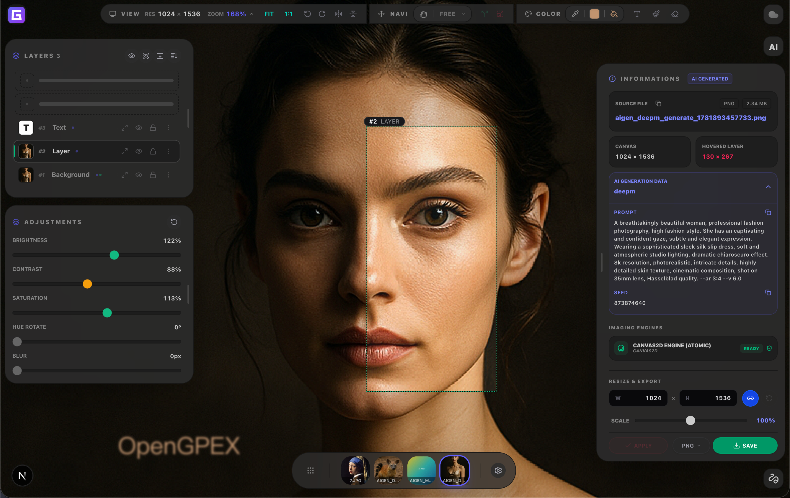

<p align="center">
  
</p>

<h1 align="center">OpenGPEX</h1>

<p align="center">
  <strong>Open-source, browser-native image editor with integrated AI</strong><br/>
  No install · No upload · Fully private · AI when you want it
</p>

<!-- ═══════════ Badges ═══════════ -->
<p align="center">
  
  <a href="./LICENSE"></a>
  
  
  
  
</p>

<!-- ═══════════ CTA ═══════════ -->
<p align="center">
  <a href="#-quick-start">Quick Start</a>&nbsp;&nbsp;|&nbsp;&nbsp;
  <a href="https://gpex.cloud/docs">Docs</a>&nbsp;&nbsp;|&nbsp;&nbsp;
  <a href="#-plugin-system">Plugins</a>&nbsp;&nbsp;|&nbsp;&nbsp;
  <a href="./CHANGELOG.md">Changelog</a>
</p>

---

<!-- ═══════════ Hero ═══════════ -->
<p align="center">
  <a href="https://gpex.cloud">
    
  </a>
</p>

<p align="center"><em>👆 Try it live at <a href="https://gpex.cloud">gpex.cloud</a> — Drag an image → edit with layers, masks & AI tools → export. All in the browser.</em></p>

> [!NOTE]
> **Beta** — Core editing is stable and developer-tested. Some advanced features are being polished. [Issues](https://github.com/gpex-cloud/opengpex/issues) and PRs are welcome!

---

## ✨ Why OpenGPEX?

**Professional image editing that runs entirely in your browser — with optional, private AI superpowers.**

OpenGPEX gives you full creative control: use traditional manual tools for precision, or accelerate with AI when you choose. Your images never leave your device unless you explicitly opt in to cloud sync.

| Feature | Description |
|---------|-------------|
| 🖼️ **10+ Formats** | Open anything: PNG · JPEG · WebP · AVIF · TIFF (16-bit) · SVG · EPS · RAW (CR2/NEF/ARW/DNG) · HEIC · GIF (animated) · BMP |
| 🤖 **AI When You Want It** | Background removal, AI segmentation (SAM 2.1), super-resolution upscale, ComfyUI & LLM integration — all optional, all private, all client-side. |
| 🛡️ **Non-Destructive** | Your original image is never modified. Edits are pure metadata — always reversible, always lossless. |
| ⚡ **Smooth & Responsive** | Pan, zoom, and brush at 60 FPS. Handles 100MP+ images without slowing down or running out of memory. |
| 🕰️ **Smart Undo** | Unlimited undo/redo that never jumps your viewport — you stay exactly where you were working. |
| ☁️ **Cloud Sync** | Optional [GPEX Cloud](https://gpex.cloud) — save, load, and share across devices. Works fully offline too. |
| 🧩 **Extensible** | Everything is a plugin. Install community extensions at runtime, or build your own. |
| 🔒 **Private by Design** | Your images never leave your device. AI runs locally in your browser — zero server-side processing. |

---

## 🌐 Try It Now

> **No setup required** — Open **[gpex.cloud](https://gpex.cloud)** in your browser and start editing immediately.  
> Cloud version includes auto-save, cross-device sync, and always up-to-date features.

---

## 🎨 Features at a Glance

### Core Editing
- **Layers** — Multi-layer compositing with 16 blend modes, opacity, fill, lock, visibility
- **Brush & Eraser** — Catmull-Rom spline smoothing, adjustable size/opacity/hardness, stamp-based rendering
- **Non-destructive Eraser** — Eraser paints a mask (not pixels); Tab to Restore hidden content anytime
- **Text** — Inline contenteditable DOM editing with full IME (CJK) support, 60+ fonts, Google Fonts search, local font access
- **Transform** — Move, scale (proportional/free), 8-direction handles

### Color & Adjustments (5-tab panel)
- **Basic** — Brightness, Contrast, Saturation, Hue Rotate, Blur
- **Curves** — RGB + per-channel cubic spline tonal control
- **Levels** — Histogram-based with Auto-levels
- **Channel Mixer** — 3×3 matrix with 7 presets (B&W, Sepia, Cross Process, etc.)
- **Color Balance** — Shadows/Midtones/Highlights color shifts with preserve-luminosity

### Selection & Clipping
- **5 tools**: Rectangle, Ellipse, Lasso, Magic Wand, SAM (AI segmentation)
- **Operations**: Peel (cut to layer), Stamp (copy to layer), Invert, Select from Alpha, Offset (expand/contract)
- **Feathering** with soft graduated edges

### AI Tools (Optional, Client-side)
- **Background Removal** — RMBG 1.4 / InSPyReNet Ultra
- **AI Segmentation** — SAM 2.1 (point prompt + auto-segment)
- **Super Resolution** — 2× / 4× upscale with AI detail enhancement
- **ComfyUI Bridge** — Connect to local/remote ComfyUI for inpainting, style transfer, ControlNet, custom workflows
- **LLM Image Bridge** — OpenAI-compatible API for text-to-image generation, editing, and variations

### Multi-Document & Organization
- **Creation/Branch model** — Trunk/Branch hierarchy for organizing AI multi-results and derived images
- **TabDock** — Floating dock with thumbnails, branch badges, and configurable layout
- **Animated Images** — Multi-frame GIF/APNG import, playback, and re-export

### Export
- JPEG, PNG, WebP, AVIF, TIFF (8/16/32-bit), GIF (animated), BMP
- Configurable quality, DPI, dimensions, ICC profile embedding
- EXIF/metadata preservation

---

## 🚀 Quick Start

```bash
git clone https://github.com/gpex-cloud/opengpex.git && cd opengpex && pnpm install && pnpm dev
```

Open **http://localhost:3030** — drag an image in to start editing.  
Or skip setup entirely: **[gpex.cloud](https://gpex.cloud)** (online version).

<details>
<summary>Production build</summary>

```bash
pnpm build && pnpm start
```
</details>

---

## 🧩 Plugin System

Everything in OpenGPEX is a plugin — tools, panels, overlays, and effects.

```
plugins/
├── base/         # Official plugins (shipped with core)
├── community/    # Community-contributed
└── user/         # Your local dev sandbox
```

Each plugin is a self-contained module with:
- **`commands`** — Dispatchable actions with optional keyboard shortcuts
- **`signals`** — Reactive state for cross-plugin communication
- **`component`** — React UI rendered into named slots
- **`interactions`** — Gesture handlers with priority-based routing
- **`contributions`** — Declarative slot/menu contributions

Install plugins at runtime via ZIP upload through the Plugin Hub. Build your own with the [Plugin Development Guide](https://gpex.cloud/docs/plugin-overview).

---

## 🛠️ Tech Stack

| Layer | Technology |
|-------|-----------|
| Framework | Next.js 16 · React 19 |
| State | Immer + custom store with dual-track (fast/slow) and volatile refs |
| Styling | Tailwind CSS v4 |
| Rendering | OffscreenCanvas + Web Workers + tiled engine + isomorphic painter |
| AI/ML | ONNX Runtime WebAssembly (client-side inference) |
| Formats | wasm-vips · LibRaw-Wasm · resvg-js · gifenc |
| Animation | Framer Motion · GSAP |
| Cloud | Cloudflare R2 + D1 + Workers (optional) |

---

## 🤝 Contributing

Contributions are welcome! See [CONTRIBUTING.md](./CONTRIBUTING.md) for details.

```bash
# Fork → Clone → Branch → Code → Lint → PR
pnpm lint   # Run before committing
```

---

## 📄 Third-party Models

AI features download pre-trained models on-demand from HuggingFace (not bundled). Users choose when to download — no forced network usage:

| Model | Purpose | Source | License |
|-------|---------|--------|---------|
| RMBG 1.4 | Background removal | [briaai/RMBG-1.4](https://huggingface.co/briaai/RMBG-1.4) | BRIA RMBG-1.4 (non-commercial) |
| InSPyReNet Ultra | Background removal (high-quality edges) | [OS-Software/InSPyReNet-SwinB-Plus-Ultra-ONNX](https://huggingface.co/OS-Software/InSPyReNet-SwinB-Plus-Ultra-ONNX) | MIT |
| SAM 2.1 | AI segmentation (Segment Anything) | [anthropics/sam2.1-hiera-tiny](https://huggingface.co/anthropics/sam2.1-hiera-tiny) | Apache-2.0 |
| Upscale models | Super-resolution (2×/4×) | Various (ESRGAN-based) | Model-specific |

---

## 📦 Third-party Libraries

The following pre-compiled WASM/JS libraries are bundled in `public/ext/` for client-side format processing:

> [!NOTE]
> Next.js is configured with Cross-Origin Isolation headers (`COOP`/`COEP`) to enable `SharedArrayBuffer`, allowing multi-threaded WASM processing (e.g. for `wasm-vips`).

| Library | Purpose | Source | License |
|---------|---------|--------|---------|
| LibRaw-Wasm | RAW image decoding (CR2/NEF/ARW) | [ybouane/LibRaw-Wasm](https://github.com/ybouane/LibRaw-Wasm) | ISC |
| resvg-js | SVG rendering & rasterization | [thx/resvg-js](https://github.com/thx/resvg-js) | MPL-2.0 |
| ghostpdl-wasm | PostScript/PDF processing | [okathira-dev/ghostpdl-wasm](https://github.com/okathira-dev/ghostpdl-wasm) | AGPL-3.0 |
| heic-to | HEIC/HEIF format conversion | [hoppergee/heic-to](https://github.com/hoppergee/heic-to) | GPL-3.0 |
| wasm-vips | TIFF/AVIF encoding & decoding, CMYK conversion | [kleisauke/wasm-vips](https://github.com/kleisauke/wasm-vips) | MIT / LGPL-3.0 |
| gifenc | GIF multi-frame encoding | [mattdesl/gifenc](https://github.com/mattdesl/gifenc) | MIT |

---

## ⚖️ License

**GPL-3.0-only** — see [LICENSE](./LICENSE).

Third-party plugins loaded dynamically at runtime are independent works and may use any license. Plugins in the source tree are covered by GPL-3.0.

---

<p align="center">
  <sub>If OpenGPEX helps you, consider giving it a ⭐ — it keeps the project going!</sub>
</p>
